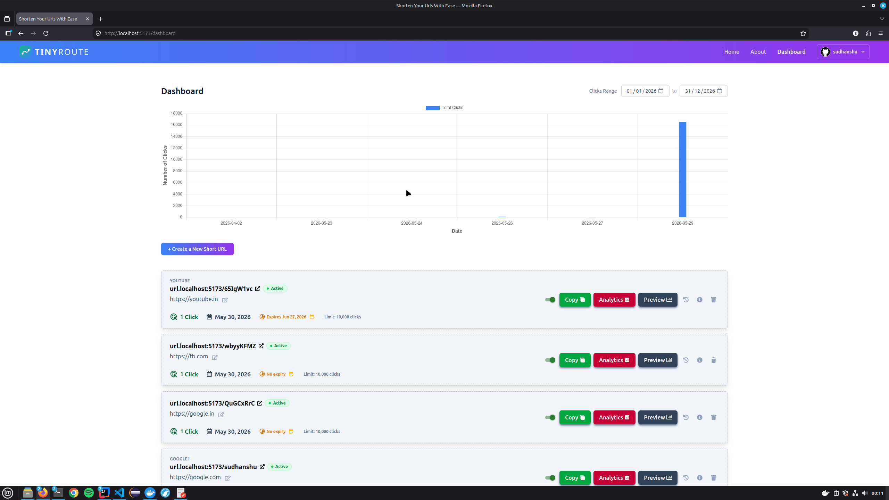
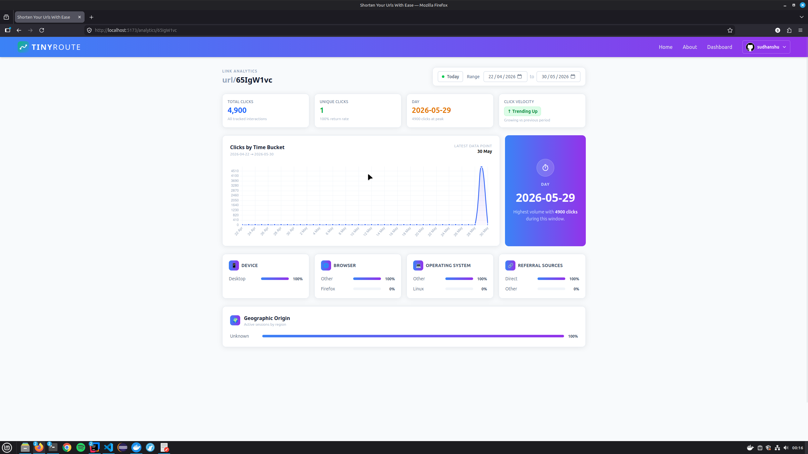
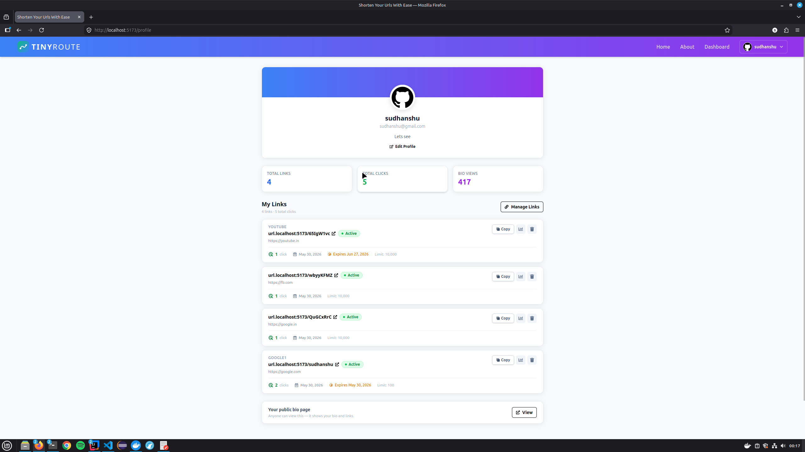
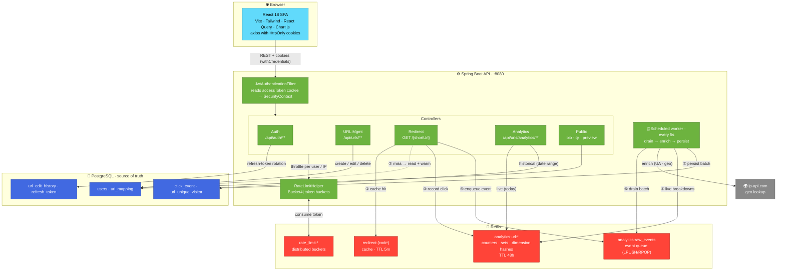

<h1 align="center">🔗 TinyRoute</h1>

<p align="center">
  A full-stack URL shortener with real-time click analytics, QR codes, link previews, and public link-in-bio pages.
</p>

<p align="center">
  <!-- Backend -->
  
  
  
  
  
  
</p>
<p align="center">
  <!-- Data -->
  
  
  
</p>
<p align="center">
  <!-- Frontend & tooling -->
  
  
  
  
  
  
  
</p>

---

## Features

- Shorten URLs with optional custom alias, expiry date, and click limit
- Live analytics dashboard (Redis counters — device / browser / OS / country breakdown)
- Historical analytics with time-bucketed charts and click-velocity trend
- QR code generation per link
- OG metadata preview scrape (title, description, image)
- Public bio page — shareable link-in-bio page per user
- JWT auth via HttpOnly cookies (access + refresh token rotation with reuse detection)
- Rate limiting per endpoint, per user or IP (Bucket4j + Redis)
- URL validation: scheme, port, private-IP ranges (SSRF), domain blacklist

---

## Screenshots

**Dashboard** — create, manage, and track all your short links in one place.



**Analytics** — live click counters, time-bucketed trends, and device / browser / OS / country breakdowns.



**Profile Page** — showcase your public profile with avatar, bio, link collection, and engagement statistics.



---

## System architecture

How the **frontend**, **backend**, **PostgreSQL**, and **Redis** relate — and the four signature flows (auth, redirect hot path, async analytics, rate limiting):



**Reading the flow (① → ⑦):** a redirect resolves from the Redis cache (① hit), falling back to a single DB read that warms the cache on a miss (②). For active links it records the click to Redis counters — daily `INCR`, unique-visitor `SADD`, hourly `HINCRBY` (③) — and pushes the raw event onto a queue (④), with **no synchronous DB write**. The `@Scheduled` worker later drains the queue in batches (⑤), enriches each event with UA parsing + geo lookup, writes the enriched dimension breakdowns (country / device / browser / OS / referrer) back to Redis for the live view (⑥), and batch-persists the click events and unique-visitor records to PostgreSQL while bulk-updating click counts (⑦).

---

## Backend highlights

**Redirect hot path** — a normal redirect touches only Redis: one cache lookup + `INCR` (daily count), `SADD` (unique IP set), `HINCRBY` (hourly), and `LPUSH` (event queue). No synchronous DB writes.

**Analytics pipeline** — raw click events are pushed onto a Redis List. A `@Scheduled` worker drains batches of up to 500 events every 5 seconds, enriches them with UA parsing and geo lookup, then batch-inserts into PostgreSQL.

**Unique visitor counting** — Redis Sets deduplicate IPs per URL per day on the hot path; the worker persists first-visit records with `ON CONFLICT DO NOTHING`.

**Optimistic locking** — `UrlMapping` carries a `@Version` field; `clickCount` increments via a bulk JPQL `UPDATE` to avoid read-modify-write races.

**Rate limiting** — six endpoint groups, each with its own Bucket4j token bucket in Redis, scoped to user ID (authenticated) or hashed IP (public).

---

## Load testing

The redirect hot path is benchmarked with [k6](https://k6.io). The script ([`load.js`](load.js)) fires `GET /{shortUrl}` requests (no follow-redirect) across a pool of short codes under 100 concurrent virtual users for 1 minute:

```js
import http from "k6/http";
import { check } from "k6";

export const options = {
  scenarios: {
    redirect_load: {
      executor: "constant-vus",
      vus: 100,
      duration: "1m",
    },
  },

  thresholds: {
    http_req_failed: ["rate<0.01"],
    http_req_duration: ["p(95)<200"],
  },
};

const urls = [
  "http://localhost:8080/sudhanshu",
  "http://localhost:8080/65IgW1vc",
  "http://localhost:8080/wbyyKFMZ",
  "http://localhost:8080/QuGCxRrC",
];

export default function () {
  const url = urls[Math.floor(Math.random() * urls.length)];

  const response = http.get(url, {
    redirects: 0,
  });

  check(response, {
    "returned redirect": (r) => r.status === 301 || r.status === 302,
  });
}
```

Run it with:

```bash
k6 run load.js
```

Result on a local run — **100 VUs · 60s · ~125.9k requests**:

| Metric | Value |
|--------|-------|
| Throughput | **2,097 req/s** |
| Requests | 125,902 (0 failed) |
| Latency — median | 45.79 ms |
| Latency — p90 / p95 | 58.8 ms / **83.29 ms** |
| Latency — max | 326.55 ms |
| Checks passed | 100.00% (125,902 / 125,902) |

Both thresholds pass: `http_req_failed` rate `0.00%` (< 1%) and `http_req_duration` `p(95)=83.29ms` (< 200 ms) — confirming the Redis-only hot path sustains high throughput with no synchronous DB writes.

---

## Tech stack

| Layer | Technologies |
|-------|--------------|
| **Backend** | Java 21 · Spring Boot 3.4 · Spring Security · Spring Data JPA |
| **Database** | PostgreSQL 15 · Flyway migrations |
| **Cache / Queue** | Redis 7 (Lettuce) |
| **Rate limiting** | Bucket4j 8 + Redis (distributed token buckets) |
| **Auth** | JJWT 0.12 — HttpOnly cookies, refresh-token rotation |
| **Analytics** | Redis hot-path counters + async worker → PostgreSQL |
| **QR / Preview / UA** | ZXing 3.5 · Jsoup 1.18 · uap-java 1.6 |
| **Frontend** | React 18 · Vite · Tailwind CSS · React Query · Chart.js · MUI |
| **Testing** | JUnit 5 · Mockito · Spring Boot Test (WebMvcTest · DataJpaTest · SpringBootTest) · k6 (load) |
| **API docs** | Springdoc OpenAPI 2.7 (Swagger UI) |

---

## Folder structure

```
TinyRoute/
├── backend/
│   ├── src/main/java/com/tinyroute/
│   │   ├── auth/         login, register, refresh, logout
│   │   ├── analytics/    pipeline, Redis, PostgreSQL queries, background worker
│   │   ├── url/          creation, management, preview, validation
│   │   ├── user/         profile, public bio page
│   │   ├── redirect/     GET /{shortUrl} — the hot path
│   │   ├── infra/        cache, network, rate limit
│   │   ├── ratelimit/    Bucket4j helpers, plans, endpoints
│   │   ├── security/     JWT filter, Spring Security config
│   │   ├── config/       Redis, Async, Bucket4j, Swagger
│   │   └── exception/    global handler, typed exceptions
│   ├── src/test/         WebMvcTest · DataJpaTest · SpringBootTest slices
│   ├── Dockerfile
│   └── docker-compose.yml
└── frontend/
    ├── src/
    │   ├── pages/        Dashboard, Analytics, Profile, BioPage, …
    │   ├── components/   Common, Dashboard, Analytics, Profile, Link
    │   ├── hooks/        React Query wrappers + reusable hooks
    │   └── api/          axios instance (withCredentials, refresh interceptor)
    └── vite.config.js
```

---

## API overview

| Group | Example endpoints |
|-------|------------------|
| Auth | `POST /api/auth/public/login` · `/register` · `/refresh` · `/logout` · `GET\|PUT /api/auth/profile` |
| URLs | `POST /api/urls/shorten` · `GET /api/urls` · `PUT` · `PATCH /{code}/disable` · `DELETE` |
| Analytics | `GET /api/urls/analytics/{shortUrl}` · `/analytics/{shortUrl}/live` · `/total-clicks` |
| Public | `GET /{shortUrl}` · `/api/urls/{shortUrl}/qr` · `/preview` · `/api/public/users/{username}` |

Full docs at `http://localhost:8080/swagger-ui.html` when the backend is running.

---

## Local setup

**Docker (recommended)**

```bash
cd backend
docker compose up --build
```

API → `http://localhost:8080`   Swagger → `http://localhost:8080/swagger-ui.html`

**Without Docker** — requires Java 21, PostgreSQL 15, Redis 7

```bash
createdb tinyroute
cd backend
./mvnw spring-boot:run
```

**Frontend**

```bash
cd frontend
npm install
npm run dev
```

---

## Environment variables

| Variable | Default | Notes |
|----------|---------|-------|
| `SPRING_DATASOURCE_URL` | `jdbc:postgresql://localhost:5432/tinyroute` | |
| `SPRING_DATASOURCE_USERNAME` | `root` | |
| `SPRING_DATASOURCE_PASSWORD` | `12345678` | **change in production** |
| `JWT_SECRET` | *(required)* | Base64, min 32 bytes |
| `JWT_EXPIRATION` | `172800000` | Access token TTL (ms) |
| `FRONTEND_URL` | `http://localhost:5173/` | CORS allowed origin |
| `SPRING_DATA_REDIS_HOST` | `localhost` | |
| `SPRING_DATA_REDIS_PORT` | `6379` | |
| `SPRING_DATA_REDIS_PASSWORD` | *(empty)* | |
| `SPRING_DATA_REDIS_SSL` | `false` | |

The Docker Compose file sets all of these for local use. Never commit production values.

---

## Deployment

| Service | Platform |
|---------|----------|
| Frontend | Vercel |
| Backend | Render |
| Database | Neon (managed PostgreSQL) |
| Redis | Upstash |

---

## Documentation

Detailed backend internals — redirect hot path, analytics pipeline, JWT rotation, concurrency handling, Redis key schema, and the security model — live in **[`backend/README.md`](backend/README.md)**.
